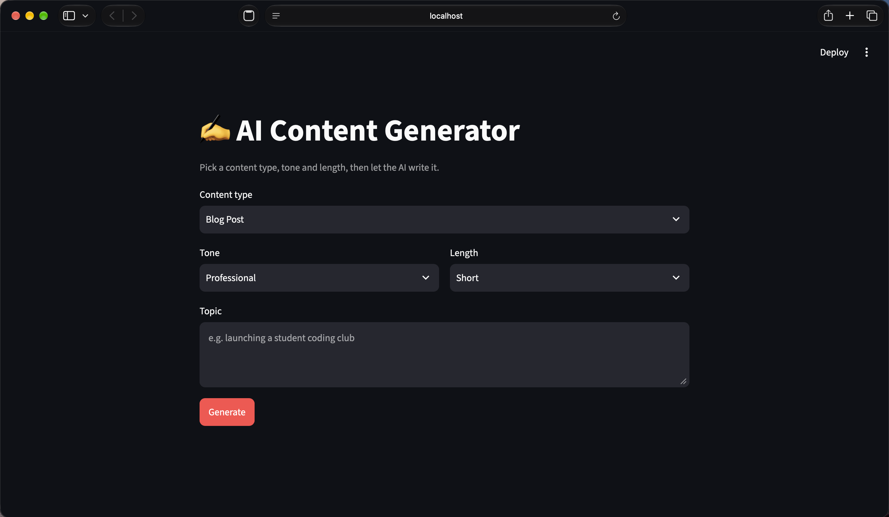

# AI Content Generator

A Python app that generates blog posts, emails, social media captions and
product descriptions using the Cohere API. Choose the content type, tone and
length, then use it from a command-line menu or a Streamlit web interface.



## Features
- 4 content types, 3 tones, 3 lengths
- Command-line and web interfaces
- Prompt templates kept separate from the code
- Input validation and error handling
- Download or save generated content as .txt

## Tech stack
Python, Cohere API, Streamlit, python-dotenv, pytest

## Setup
```bash
git clone https://github.com/omarelmashat/AI_Content_Generator.git
cd AI_Content_Generator
python3 -m venv venv
source venv/bin/activate
python -m pip install -r requirements.txt
cp .env.example .env   # then add your Cohere API key
```

## Run
```bash
python src/main.py           # command line
streamlit run src/app.py     # web interface
python -m pytest             # tests
```

## Project structure
- `api_client.py`: the only file that talks to the AI provider
- `prompts.py`: templates, tones and lengths
- `generator.py`: builds prompts and validates input
- `main.py` / `app.py`: the two interfaces

## Future improvements
- Hugging Face as an alternative provider
- Content history